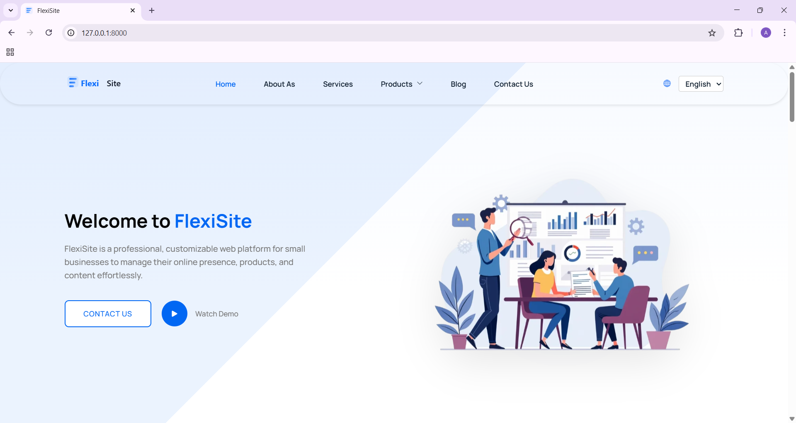
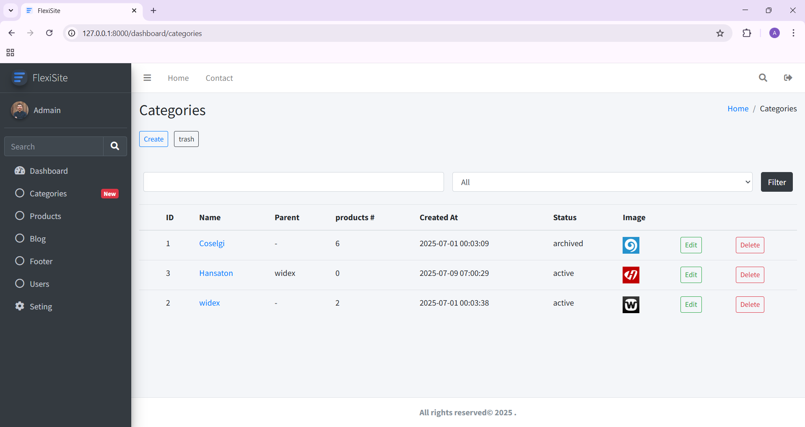

# FlexiSite

FlexiSite is a professional, customizable web platform for small businesses to manage their online presence, products, and content effortlessly.

---

## Project Status

This project is currently in development. Some features are complete, while others are in progress.

---

## Features

* **Custom Company Info:** Name, logo, and contact details
* **Website Pages:** About Us, Contact Us, Small Blog, Products, Services
* **Admin Dashboard:** CRUD operations for products and content
* **User Management:** Authentication & user roles (Laravel Breeze)
* **File Handling:** Uploads, validation, soft deletes
* **Advanced Features:** Pagination, Middleware, Localization (Arabic & English)
* **Flexible Layouts:** Blade Templates & Components

---

## Technology Stack

| Frontend    | Backend       | Database | Admin Template |
| ----------- | ------------- | -------- | -------------- |
| Bootstrap 5 | PHP Laravel 9 | MySQL    | AdminLTE       |

---

## Screenshots

### Website



### Admin Dashboard



---

## Installation

1. **Clone the repository**

```bash
git clone https://github.com/abdullahashameri/flexisite.git
cd flexisite
```

2. **Install dependencies**

```bash
composer install
npm install
npm run dev
```

3. **Configure environment**

```bash
cp .env.example .env
php artisan key:generate
```

4. **Run migrations**

```bash
php artisan migrate
```

5. **Run migrations & seed**

```bash
php artisan migrate --seed
```

6. **Serve the application**

```bash
php artisan serve
```

7. **Open the application**
   Navigate to: [http://127.0.0.1:8000](http://127.0.0.1:8000)

---

## Usage

* Manage products, blog posts, and company information from the admin dashboard.
* Fully customizable for any small business website.
