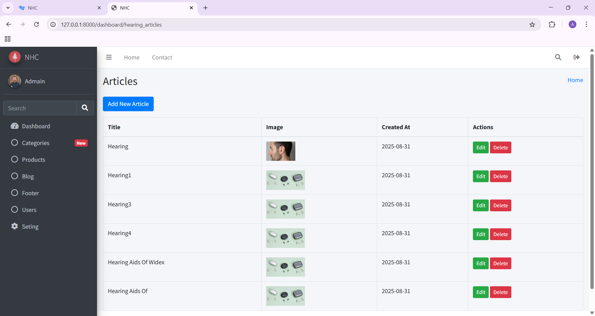
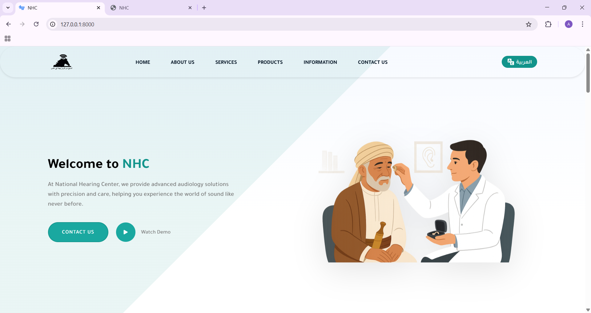
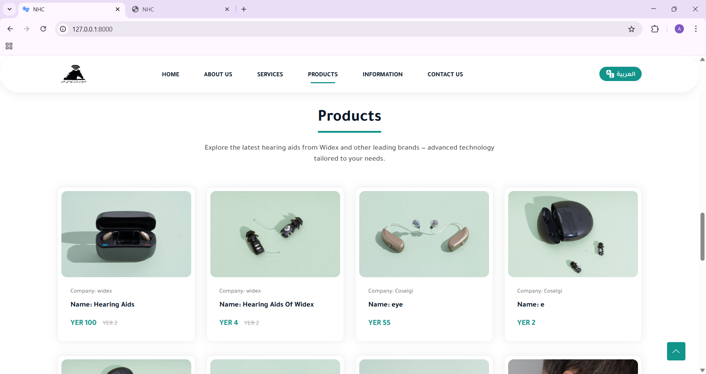
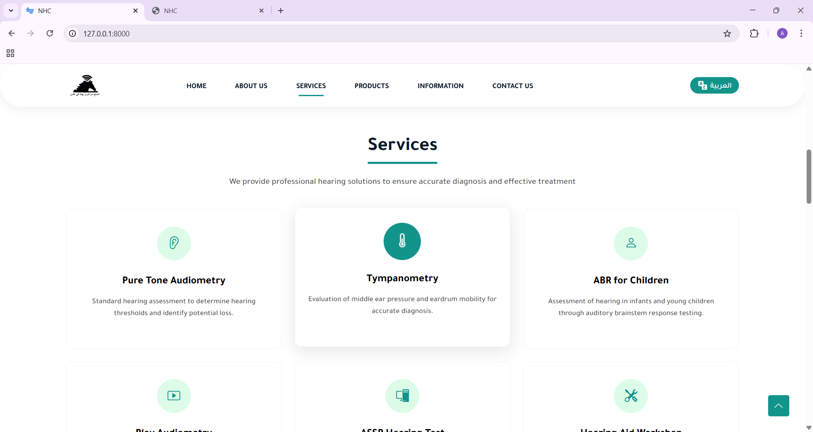
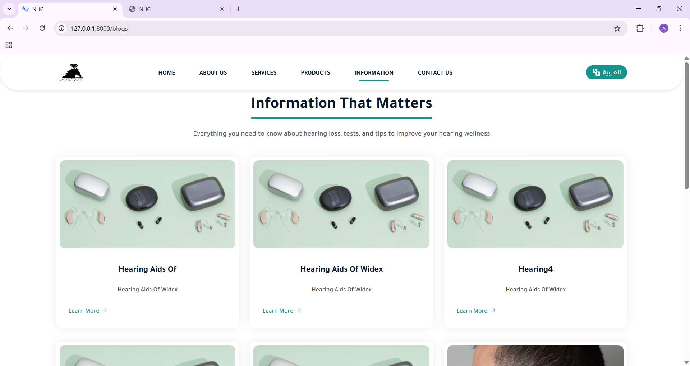

<p align="center">
  <a href="#" target="_blank">
    
  </a>
</p>

# Medical Hearing Aid Agency Website (Updated Version of FlexiSite)

<p align="center">
This is the updated version of the project README. We improved the interfaces and added new features, including user management controls.
<a href="#"></a>
</p>

---

## About the Project
This project is a professional, customizable web platform for a medical hearing aid agency. It manages services, products, articles, and user content effortlessly.

**Project Highlights:**
- Fully responsive website with modern layouts.
- Improved admin dashboard with CRUD operations for articles, products, and users.
- User management system for roles and access control.
- Optimized for accessibility and user experience.

---

## Features
* **Custom Company Info:** Name, logo, and contact details
* **Website Pages:** Home, About, Contact, Services, Products, Articles
* **Admin Dashboard:** Full CRUD for products, articles, categories, and footer content
* **User Management:** Authentication & roles, user access control
* **File Handling:** Uploads, validation, soft deletes
* **Advanced Features:** Pagination, Middleware, Localization (Arabic & English)
* **Flexible Layouts:** Blade templates & components

---

## Technology Stack
| Frontend    | Backend       | Database | Admin Template |
| ----------- | ------------- | -------- | -------------- |
| Bootstrap 5 | PHP Laravel 9 | MySQL    | AdminLTE       |

---

## Screenshots
- **Admin Dashboard**

- **Articles Management**





---

## Installation

1. **Clone the repository**
```bash
git clone https://github.com/abdullahashameri/Medical-Hearing-Aid-Website.git
cd Medical-Hearing-Aid-Website
